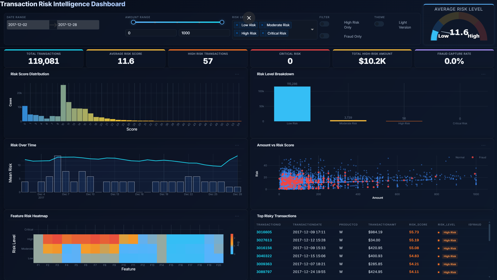

# Transaction Risk Intelligence Dashboard

Interactive dashboard for exploratory analysis of the IEEE-CIS Fraud Detection dataset, combining machine learning-based risk scoring with real-time filtering and interactive visualizations.

## Overview

Financial institutions process millions of transactions daily, making manual fraud detection infeasible. This dashboard provides a unified interface to visualize transaction risk, identify anomalous patterns, and investigate suspicious activity across multiple dimensions.

It merges transaction and identity data, computes a composite 0-100 risk score per transaction using Isolation Forest, statistical outlier detection, and behavioral rarity signals, then presents the results through an interactive, filterable interface built with Dash and Plotly.

## Dashboard Preview



## KPIs

The dashboard tracks six metrics that update dynamically as filters are applied.

**Total Transactions**
- Count of transactions matching the current filter state.
- Establishes the baseline volume for analysis. Drops in filtered volume signal narrow criteria; large volumes require sampling-aware exploration.

**Average Risk Score**
- Mean of the composite 0-100 risk score across all filtered transactions.
- Single-number indicator of overall portfolio risk. A rising average suggests emerging threat patterns or policy gaps requiring investigation.

**High Risk Transactions**
- Count of transactions with a risk score of 50 or above.
- Defines the set of transactions that cross the high-risk threshold. Monitoring this count over time reveals whether risk exposure is concentrated or expanding.

**Critical Risk**
- Count of transactions with a risk score of 75 or above.
- Represents the narrowest and most severe classification. Immediate investigation is warranted when this metric shows sustained increases.

**Total High-Risk Amount**
- Sum of transaction amounts for all high-risk (score >= 50) transactions.
- Translates risk into financial exposure. A high count of low-risk amounts is less concerning than a smaller count of high-value risky transactions.

**Fraud Capture Rate**
- Percentage of confirmed fraud cases that were flagged as high risk by the scoring engine.
- Measures detection effectiveness. A low capture rate indicates the model may be missing fraud patterns that require recalibration.

## Dashboard Structure

**Filter bar** -- Five-column layout for date range, amount range (slider plus manual inputs), risk level multi-select, fraud/high-risk toggles, and theme controls.

**Gauge** -- Reactive speedometer-style gauge displaying the average risk score, with color-coded zones and a dynamic SVG needle.

**KPI row** -- Six metric cards displayed side-by-side, updating in real time with every filter change.

**Charts** (3 rows x 2 columns):

1. **Risk Distribution** -- Histogram of risk scores (40 bins) with gradient color coding from low (cyan) to high (red). Reveals the shape of the risk population -- whether it is bimodal, skewed, or uniform.

2. **Risk Breakdown** -- Bar chart of transaction counts grouped by risk level (Low, Moderate, High, Critical). Shows the composition of the risk portfolio at a glance.

3. **Risk Over Time** -- Dual-axis visualization combining a line for mean daily risk with bars for high-risk transaction counts. Identifies temporal spikes, trending behavior, or seasonal anomalies.

4. **Amount vs Risk Feature** -- Scatter plot of transaction amount against risk score, color-coded by fraud flag (Normal in blue, Fraud in red). Subsampled to 12,000 points for performance. Surfaces whether high amounts correlate with elevated risk.

5. **Feature Heatmap** -- Mean V-feature values (first 20 V-columns) grouped by risk level, using a cyan-to-red colorscale. Exposes which engineered features drive risk separation across levels.

6. **Top Risky Transactions** -- Table of the 20 highest-scoring transactions with TransactionID, date, product code, amount, risk score (color-coded), risk level badge, and fraud flag. Provides an investigation-ready starting point for case review.

## Methodology

**Data preprocessing** -- Transaction and identity tables are merged on TransactionID. Synthetic dates are generated from the transaction time offset (reference: 2017-12-01). Identity columns with over 98% nulls are excluded; categorical columns are capped at 40 unique values to avoid cardinality issues. Data is sampled to 120,000 rows for responsiveness.

**Risk scoring** -- Composite score calculated from four weighted components:
- **Model (45%)**: Isolation Forest (200 estimators) applied to numerical features including TransactionAmt, distance metrics, V-columns, and identity numeric columns.
- **Amount (25%)**: Robust Z-score of TransactionAmt using median and MAD, min-max normalized.
- **Feature (20%)**: Mean absolute value of V-columns, min-max normalized.
- **Rarity (10%)**: Inverse frequency of card1 occurrences combined with email domain mismatch detection.

Risk levels are assigned by score thresholds: Low (< 25), Moderate (25-50), High (50-75), Critical (75+). Binary flags (is_high_risk, is_critical_risk) support filtering.

**Filtering engine** -- Date range, amount range, risk level, fraud-only, and high-risk-only filters combine to produce a dynamically filtered dataset that drives all charts and KPIs simultaneously.

## Tech Stack

- **Python** -- Core language
- **Dash** 2.18.2 -- Web application framework
- **Plotly** 5.24.1 -- Interactive charting library
- **dash-bootstrap-components** 1.6.0 -- UI component styling
- **Pandas** 2.2.3 / **NumPy** 2.1.3 -- Data manipulation
- **scikit-learn** 1.5.2 -- Isolation Forest model

## How to Run

```bash
# 1. Clone or navigate to the project directory
cd ieee_fraud_dashboard_project

# 2. Create and activate a virtual environment
python -m venv .venv
.venv\Scripts\Activate.ps1   # Windows
# source .venv/bin/activate  # Linux/macOS

# 3. Install dependencies
pip install -r requirements.txt

# 4. Place data files in the data/ directory
#    - train_transaction.csv
#    - train_identity.csv
#    Download from the IEEE-CIS Fraud Detection Kaggle competition,
#    or run: python download_data.py

# 5. Launch the dashboard
python app.py

# 6. Open http://localhost:8051 in your browser
```

## Business Value

This dashboard transforms raw transaction data into actionable risk intelligence. Analysts can:

- **Monitor risk trends** -- The time-series view reveals whether anomalous behavior is episodic or sustained, informing whether to trigger automated blocking rules or schedule manual review.
- **Prioritize investigations** -- The top-risk table surfaces the highest-value targets for case review, reducing time-to-detection from batched reports to real-time exploration.
- **Validate detection coverage** -- The fraud capture rate KPI quantifies how well the scoring engine identifies confirmed fraud, providing a feedback loop for model tuning.
- **Assess financial exposure** -- Total high-risk amount translates abstract risk scores into dollar figures that stakeholders can act on -- e.g., freezing accounts, increasing scrutiny on certain product codes, or adjusting velocity limits.
- **Explore interactively** -- Date range, amount, and risk level filters allow analysts to drill into specific slices without writing queries or rerunning batch jobs, making it a practical tool for ad-hoc investigations and compliance reporting.
=======
# ieee_fraud_dashboard_project
